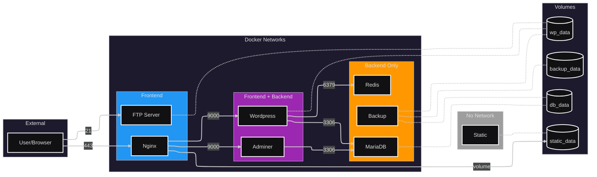

<div align="center">
  
</div>

# inception

This is my Inception project: a containerized web infrastructure using Docker and Docker Compose on a VPS, done during the 42 common core.
The mandatory part is NGINX with TLS, Wordpress/PHP-FPM, and MariaDB each in its own container, no pre-built images, everything built from Dockerfiles. For the bonus I added Redis caching, Adminer, FTP, a static site, and automated backups.
The main challenges were networking between containers, volume persistence, secrets management, and making services wait for their dependencies. Everything rebuilds from scratch with simple ```make``` aliases, which are used to launch the docker compose commands. You can find the commands details below.

## Table of Contents

- [About](#inception)
- [Requirements](#requirements)
- [Instructions](#instructions)
- [Features](#features)
- [Architecture](#architecture)
- [Security](#security)
- [Design Choices](#design-choices)
- [Resources](#resources)
- [AI Usage](#ai-usage)
- [Note on Project State](#note-on-project-state)
- [Known Issues & Fix Suggestions](#known-issues--fix-suggestions)
- [License](#license)
---
- [User Documentation](USER_DOC.md)
- [Developer Documentation](DEV_DOC.md)

## Requirements

- A Virtual Machine or VPS running Linux (Debian/Ubuntu recommended)
- Docker Engine
- Docker Compose
- Make

## Instructions

### First Launch

```bash
make 
```

Which equates to:

```bash
mkdir -p /home/user/data/mariadb \
&& mkdir -p /home/user/data/wordpress \
&& mkdir -p /home/user/data/backup

docker compose -f srcs/docker-compose.yml up -d
```

This creates the data directories and starts all containers.

### Main Commands

| Command | Description |
|---------|-------------|
| `make` | Create dirs and start containers |
| `make build` | Build/rebuild images and start |
| `make restart` | Restart services |
| `make down` | Stop containers |
| `make re` | Full rebuild (fclean + build) |
| `make clean` | Stop containers and remove volumes |
| `make fclean` | Clean + prune dangling volumes |


### Utilities

| Command | Description |
|---------|-------------|
| `make ps` | Show running containers |
| `make plugins` | List Wordpress plugins |


## Features

### Mandatory

- NGINX with TLSv1.2/TLSv1.3
- Wordpress + PHP-FPM
- MariaDB
- Persistent volumes (bind mounts)
- Docker secrets for passwords
- Health checks with dependencies
- Frontend/backend network isolation

### Bonus

- Redis cache
- Adminer (DB management)
- FTP server (vsftpd)
- Static website
- Automated backups

## Architecture



## Security

### Considerations
- Secrets are handled using Docker secrets, not environment variables.
- Internal services (MariaDB, Redis, Backup) run on a backend-only Docker network and are not exposed to the host.
- Wordpress and Adminer are not directly exposed to the host.
- Only NGINX (443) and FTP (21 + passive range) publish ports to the host.
- HTTPS is enforced using TLSv1.2 and TLSv1.3 to maximize compatibility, with older insecure protocols (TLSv1.0 and TLSv1.1) disabled.

### Tradeoffs
- FTP is exposed as a bonus service and is inherently insecure unless configured with TLS.

## Design Choices
  
### Virtual Machines vs Docker
| VM | Docker |
|----|--------|
| Full OS per instance | Shares host kernel |
| Heavy (GB) | Lightweight (MB) |
| Slow startup (min) | Instant startup (sec) |
| Strong isolation | Process-level isolation |

Docker was chosen for its speed, lightweight footprint, and service isolation.
Each service runs isolated without the overhead of multiple operating systems and duplicate files thanks to mechanisms like UFS (Union File System).

---

### Secrets vs Environment Variables
| Environment Variables | Secrets |
|-----------------------|---------|
| Visible in `docker inspect` | Mounted as files in `/run/secrets` |
| Stored in compose file or `.env` | Stored in separate files |
| Less secure | More secure |

Secrets are used for passwords to avoid exposing them in process listings or containers inspection.

---

### Docker Network vs Host Network
| Host Network | Docker Network |
|--------------|----------------|
| Container uses host's network directly | Isolated virtual network |
| No port mapping needed | Requires port exposure |
| No isolation between containers | Services isolated by network |

Custom networks (frontend/backend) allow controlling which services can communicate, separating services in two main categories to isolate backend processes like MariaDB.

---

### Docker Volumes vs Bind Mounts
| Volumes | Bind Mounts |
|---------|-------------|
| Managed by Docker | Direct path on host |
| Portable | Host-dependent |
| Harder to inspect | Easy to access/backup |

Bind mounts are used for data persistence as required by the subject. The data is stored in `/home/user/data/`.
    
## Resources

### Mandatory
- [Docker Documentation](https://docs.docker.com/)
- [Docker Compose Documentation](https://docs.docker.com/compose/compose-file/)
- [Nginx Documentation](https://nginx.org/en/docs/)
- [Wordpress Documentation](https://developer.wordpress.org/cli/commands/)
- [MariaDB Documentation](https://mariadb.com/kb/en/documentation/)
- [A Great Article on Inception by Ahmed Fatir](https://medium.com/@afatir.ahmedfatir/unveiling-42-the-network-inception-a-dive-into-docker-and-docker-compose-cfda98d9f4ac)

### Bonus
- [Adminer Website](https://www.adminer.org/)
- [Vsftpd Documentation](https://security.appspot.com/vsftpd.html)
- [Redis Documentation](https://redis.io/docs/)

## AI Usage

AI tools were used throughout development for:

### Learning and Concepts:
- Understanding foundational concepts: PID 1's role in containers, SSL/TLS certificates, Linux namespaces, cgroups, Union File System.
- Networking concepts: NAT, reverse proxies, ports, DNS, bridge vs host networks.
- Web server architecture: CGI/FastCGI, PHP-FPM, the history of dynamic web content.

### Docker:
- Learning Dockerfile and Docker Compose syntax.
- Understanding volume types (bind mounts vs named volumes) and network modes (host, bridge, custom).
- Optimizing image layers: consolidating RUN instructions, using `--no-install-recommends`, cleaning apt caches.

### Debugging and Best Practices:
- Fixing Dockerfile and Compose syntax errors.
- Advice on practices like using EXPOSE for documentation.

### Bonus Services:
- Understanding FTP passive mode quirks in containers (ports 21 and 21100-21150).
- Building the static site with HTML/CSS/Tailwind, including pseudo-element techniques for animated backgrounds.

### Documentation:
- Structuring and writing these README files.

## Note on Project State

All projects from my 42 cursus are preserved in their state immediately following their final evaluation. While they may contain mistakes or stylistic errors, I've chosen not to alter them. This approach provides a clear and authentic timeline of my progress and learning journey as a programmer.

## Known Issues & Fix Suggestions

The vsftpd container includes a healthcheck that is too strict.
Under certain timing conditions, it may temporarily report the service as unhealthy, which can trigger container restarts.
This does not affect real usage. It only causes unnecessary restarts.

The issue can be fixed easily by:

- Increasing the healthcheck `interval` and `timeout`.
- Relaxing the test condition.
- Or removing the healthcheck entirely.

## License

[MIT](https://choosealicense.com/licenses/mit/)  
